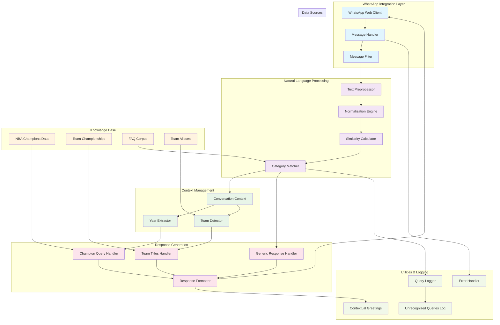

# NBA WhatsApp Bot 🏀

Un bot inteligente de WhatsApp especializado en información de la NBA que utiliza procesamiento de lenguaje natural (PLN) para responder consultas sobre la historia del baloncesto profesional americano.

## 🎯 ¿Qué hace el bot?

El NBA WhatsApp Bot es un asistente conversacional que proporciona información detallada sobre:

- **Campeones NBA por año** (1947-2024)
- **Títulos de equipos específicos**
- **Records históricos de la NBA**
- **Información general de equipos**
- **Respuestas contextuales inteligentes**

El bot utiliza algoritmos de similitud de texto y procesamiento de lenguaje natural para comprender consultas en español e inglés, ofreciendo respuestas precisas y contextualizadas.

## ✨ Features

### 🧠 Procesamiento de Lenguaje Natural
- **Algoritmo de matching inteligente** con cálculo de confianza
- **Normalización de texto** con eliminación de acentos y caracteres especiales
- **Detección de años** en formato completo (1947-2024) y abreviado (47-24)
- **Detección robusta de equipos** con múltiples sinónimos y alias
- **Similitud de texto** usando distancia de Levenshtein mejorada

### 📊 Base de Conocimiento
- **78 años de historia NBA** (1947-2024)
- **Datos completos de campeones** con resultados detallados de series
- **30 equipos NBA actuales** con información de títulos
- **Records históricos** de anotadores, reboteadores y asistencias

### 🤖 Funcionalidades del Bot
- **Mensajes de bienvenida automáticos** con imagen promocional
- **Contexto conversacional** que recuerda interacciones recientes
- **Respuestas contextuales** que se adaptan al flujo de conversación
- **Logging de consultas no reconocidas** para mejora continua
- **Manejo robusto de errores** con mensajes informativos

### 🎯 Tipos de Consultas Soportadas

#### Campeones por Año
```
- "¿Quién ganó en 1998?"
- "Campeón de 2016"
- "Título 2020"
- "98" (año abreviado)
```

#### Títulos de Equipos
```
- "Títulos de los Lakers"
- "Cuántos anillos tienen los Bulls"
- "Campeonatos de los Celtics"
```

#### Records Históricos
```
- "Records NBA"
- "Máximo anotador"
- "Más puntos en la historia"
```

#### Información General
```
- "Equipos NBA"
- "Hola" (saludo)
- "Gracias"
```

## 🔧 Cómo Funciona

### 1. **Inicialización**
- El bot se conecta a WhatsApp Web usando `whatsapp-web.js`
- Genera QR para autenticación
- Envía mensajes de bienvenida a usuarios configurados

### 2. **Procesamiento de Mensajes**
```javascript
Mensaje recibido → Filtrado → Normalización → Análisis NLP → Respuesta
```

### 3. **Algoritmo de Matching**
- **Preprocesamiento**: Normalización y limpieza del texto
- **Cálculo de similitud**: Comparación con corpus de preguntas frecuentes
- **Scoring**: Asignación de puntuación de confianza (0-1)
- **Threshold**: Umbral mínimo de 0.1 para activar respuesta

### 4. **Detección de Contexto**
- **Extracción de años**: Patrones regex para años completos y abreviados
- **Detección de equipos**: Mapeo con múltiples alias y sinónimos
- **Contexto conversacional**: Historial de últimas 10 interacciones

### 5. **Generación de Respuestas**
- **Respuestas dinámicas**: Basadas en datos estructurados
- **Saludos contextuales**: Adaptados al número de interacciones
- **Formato rico**: Uso de emojis y markdown para mejor legibilidad

## 🏗️ Arquitectura del Sistema



### Componentes Principales

#### 🔌 **Capa de Integración WhatsApp**
- **WhatsAppBot**: Clase principal que maneja la conexión
- **Message Handler**: Procesa mensajes entrantes y filtra spam
- **Authentication**: Manejo de QR y sesiones persistentes

#### 🧠 **Motor de PLN**
- **Text Preprocessor**: Normalización y limpieza de texto
- **Similarity Calculator**: Algoritmo de distancia de Levenshtein mejorado
- **Category Matcher**: Sistema de scoring para categorías FAQ

#### 🎯 **Gestión de Contexto**
- **Conversation Context**: Historial de conversaciones por usuario
- **Year Extractor**: Detección inteligente de años (4 y 2 dígitos)
- **Team Detector**: Mapeo robusto de nombres de equipos

#### 📚 **Base de Conocimiento**
- **Champions Dataset**: 78 años de campeones NBA (1947-2024)
- **Team Championships**: Títulos por equipo con años
- **FAQ Corpus**: Categorías de preguntas con keywords
- **Team Aliases**: Sinónimos y variaciones de nombres

#### 🎨 **Generación de Respuestas**
- **Specialized Handlers**: Manejadores específicos por tipo de consulta
- **Response Formatter**: Formateo con emojis y estructura clara
- **Contextual Greetings**: Saludos adaptativos según interacción

## 🚀 Instalación y Configuración

### Prerrequisitos
```bash
Node.js >= 16
npm o yarn
```

### Instalación
```bash
# Clonar repositorio
git clone <repository-url>
cd nba-whatsapp-bot

# Instalar dependencias
npm install

# Configurar usuarios de bienvenida (opcional)
# Editar src/bot/config/usersList.js

# Ejecutar bot
npm start
```

### Primera Ejecución
1. Ejecutar `npm start`
2. Escanear QR code con WhatsApp
3. El bot enviará mensajes de bienvenida automáticamente
4. ¡Listo para recibir consultas NBA!

## 📁 Estructura del Proyecto

```
src/bot/
├── WhatsAppBot.js              # Clase principal del bot
├── index.js                    # Punto de entrada
├── config/
│   ├── corpus.js              # FAQ y categorías
│   └── usersList.js           # Lista de usuarios bienvenida
├── handlers/
│   └── messageHandler.js     # Procesamiento de mensajes
└── utils/
    ├── constants.js          # Equipos NBA conocidos
    ├── helpers.js           # Funciones auxiliares
    ├── logging.js           # Sistema de logging
    ├── messages.js          # Mensajes predefinidos
    ├── nbaApi.js           # API interna NBA
    ├── teamData.js         # Datos de equipos y campeones
    ├── teamDetector.js     # Detección de equipos
    └── textProcessing.js   # Procesamiento PLN
```

## 🔍 Métricas y Monitoring

- **Logging automático** de consultas no reconocidas
- **Contexto conversacional** para análisis de patrones
- **Métricas de confianza** para evaluación de accuracy
- **Archivo JSON** con historial de consultas fallidas

## 🎯 Casos de Uso

### Aficionado Casual
"*¿Quién ganó en el 98?*" → Información detallada de los Bulls '98

### Fanático Hardcore  
"*¿Cuántos anillos tienen los Celtics?*" → 18 títulos con año más reciente

### Consulta de Records
"*Records NBA*" → Top anotadores, reboteadores y asistencias históricas

### Conversación Natural
"*Hola*" → Saludo personalizado con menú de opciones

## 🚀 Futuras Mejoras

- [ ] Integración con APIs NBA en tiempo real
- [ ] Soporte para estadísticas de jugadores
- [ ] Consultas de temporada actual
- [ ] Múltiples idiomas
- [ ] Interface web de administración
- [ ] Análisis de sentimientos
- [ ] Respuestas con imágenes/GIFs

---

**Desarrollado con ❤️ para la comunidad NBA**